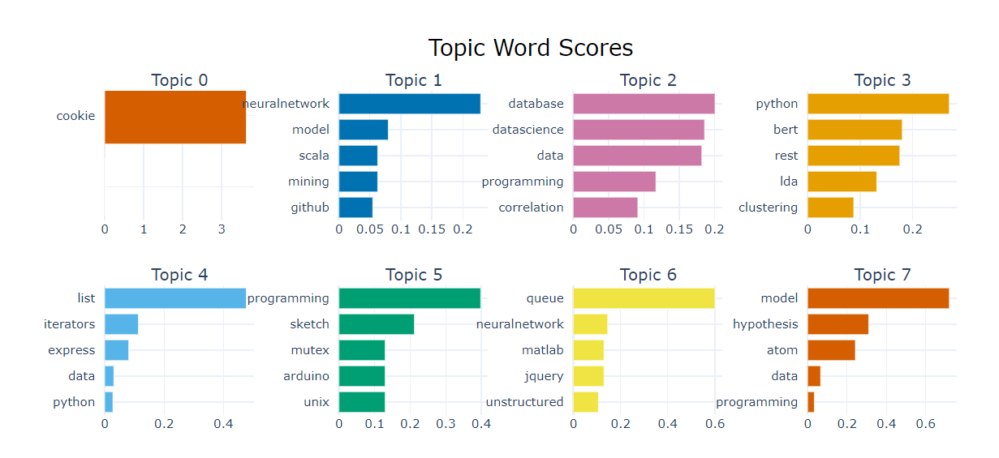

File can be run both locally and on Google Collab
However running the notebooks on google collab is advisable as BERTopic is a heavy library and might cause some installation issues and might disrupt the versions of python and pre-installed libraries.

Disclaimer: Outputs of BERTopic will not be rendered on local environment if BERTopic is not installed and will be visible only if installed.
Posts.xml is a file that is considered as a base for our dataset which has been parsed and converted to csv. However, since it is aldready parsed, the code for parsing is not attached as it might vary with the structure of different XML files.

However, if not installed on local, you can view the notebooks through the below links:
1) StackExchangeDataMining_Part1_Topic_Modeling.ipynb
https://colab.research.google.com/drive/1CdrlOv22RsUHWeKSZzuCulwFquQZU6yh?usp=drive_link

2) StackExchangeDataMining_Part2_ML.ipynb
https://colab.research.google.com/drive/1xvrvM_u6NDq1Ma0U2TQlHwLrKW0lL7Nr?ouid=115623396299002834206&usp=drive_link

Steps to run on Google Colab:

Step 1: Upload all the files attached in one folder on google drive 
If not add the below lines of code and skip the google mount patch on the files attached:

from google.colab import files
post1 = files.upload()

There are 2 files to upload:
post1.csv =  Dataset picked up from internet archive website. This is the file considered for performing analysis
technicalcorpus.py = Base Version of Corpus containing technologies used prominently since 2000. 

Step 2: Run the below files:
1) StackExchangeDataMining_Part1_Topic_Modeling.ipynb
The above file contains the topic Modeling techniques such as LDA and BERTopic applied on the stack exchange dataset to identify the most discussed technologies since 2020 in the given dataset.

This file also provides insights on the clusters(sub-topics) created within the discussed technologies based on similiarity to provide better understandings of the main topic of discussions within a certain domain of technologies to provide domain specific insights.

Eg: Topic contains python,bert,lda, clustering and rest
So such words frequently occur together in the text and are semantically connected as bert,lda are libraries within Python used for clustering.

2) StackExchangeDataMining_Part2_ML.ipynb
The above files contains the ML models used to predict the upvote scores for each posts and determine how relevant the post is and can be used to flag posts whether they are resourceful to the platform or they can be flagged and removed.
Such information can be used to show trending topics of discussion and thus can be used to make data-driven decisions and hence be beneficial to the platform.

Steps to run on local Enviroment:

Step 1: Upload all the files in one folder
Step 2: Update the path variable according to your path and run both the notebooks individually.

OUTPUT: (incase of any discrepancies in running on local environment):

LDA Output:

Hierarchical Clustering for BERTopic

Topic Word Scores:

